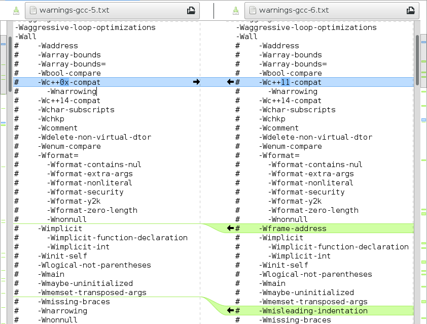

# C/C++/Objective-C compiler warning flags collection and parsers

This project includes tools and lists to figure out all warning flags
that [clang compiler](http://clang.llvm.org/) and
[GNU Compiler Collection](https://gcc.gnu.org/) have for C family
languages (C, C++, and Objective-C). This also shows all aliases and
warning flags that a certain flag enables (prefixed with "#"
character) so that you can easily see which flag is enabled by
what. There are also warning flags that do nothing for compatibility
or deprecation reasons. They are suffixed with "# DUMMY switch" text.

The purpose of these collections is to make it more easy to use the
static code analysis tools that compilers provide.

## Clang warning flags

Clang includes `-Weverything` flag, that is not shown in these lists,
that enables all warnings. Clang documentation provides
[reference for some of the diagnostic flags in Clang](https://clang.llvm.org/docs/DiagnosticsReference.html).

* clang 8 [all](clang/warnings-clang-8.txt)
  • [top level](clang/warnings-clang-top-level-8.txt)
  • [unique](clang/warnings-clang-unique-8.txt)
  • [diff](clang/warnings-clang-diff-7-8.txt)
* clang 7 [all](clang/warnings-clang-7.txt)
  • [top level](clang/warnings-clang-top-level-7.txt)
  • [unique](clang/warnings-clang-unique-7.txt)
  • [diff](clang/warnings-clang-diff-6-7.txt)
* clang 6 [all](clang/warnings-clang-6.txt)
  • [top level](clang/warnings-clang-top-level-6.txt)
  • [unique](clang/warnings-clang-unique-6.txt)
  • [diff](clang/warnings-clang-diff-5-6.txt)
* clang 5 [all](clang/warnings-clang-5.txt)
  • [top level](clang/warnings-clang-top-level-5.txt)
  • [unique](clang/warnings-clang-unique-5.txt)
  • [diff](clang/warnings-clang-diff-4-5.txt)
* clang 4 [all](clang/warnings-clang-4.txt)
  • [top level](clang/warnings-clang-top-level-4.txt)
  • [unique](clang/warnings-clang-unique-4.txt)
  • [diff](clang/warnings-clang-diff-3.9-4.txt)
* clang 3.9 [all](clang/warnings-clang-3.9.txt)
  • [top level](clang/warnings-clang-top-level-3.9.txt)
  • [unique](clang/warnings-clang-unique-3.9.txt)
  • [diff](clang/warnings-clang-diff-3.8-3.9.txt)
* clang 3.8 [all](clang/warnings-clang-3.8.txt)
  • [top level](clang/warnings-clang-top-level-3.8.txt)
  • [unique](clang/warnings-clang-unique-3.8.txt)
  • [diff](clang/warnings-clang-diff-3.7-3.8.txt)
* clang 3.7 [all](clang/warnings-clang-3.7.txt)
  • [top level](clang/warnings-clang-top-level-3.7.txt)
  • [unique](clang/warnings-clang-unique-3.7.txt)
  • [diff](clang/warnings-clang-diff-3.6-3.7.txt)
* clang 3.6 [all](clang/warnings-clang-3.6.txt)
  • [top level](clang/warnings-clang-top-level-3.6.txt)
  • [unique](clang/warnings-clang-unique-3.6.txt)
  • [diff](clang/warnings-clang-diff-3.5-3.6.txt)
* clang 3.5 [all](clang/warnings-clang-3.5.txt)
  • [top level](clang/warnings-clang-top-level-3.5.txt)
  • [unique](clang/warnings-clang-unique-3.5.txt)
  • [diff](clang/warnings-clang-diff-3.4-3.5.txt)
* clang 3.4 [all](clang/warnings-clang-3.4.txt)
  • [top level](clang/warnings-clang-top-level-3.4.txt)
  • [unique](clang/warnings-clang-unique-3.4.txt)
  • [diff](clang/warnings-clang-diff-3.3-3.4.txt)
* clang 3.3 [all](clang/warnings-clang-3.3.txt)
  • [top level](clang/warnings-clang-top-level-3.3.txt)
  • [unique](clang/warnings-clang-unique-3.3.txt)
  • [diff](clang/warnings-clang-diff-3.2-3.3.txt)
* clang 3.2 [all](clang/warnings-clang-3.2.txt)
  • [top level](clang/warnings-clang-top-level-3.2.txt)
  • [unique](clang/warnings-clang-unique-3.2.txt)

## GCC warning flags

If you need a full list of
[GCC warning options](https://gcc.gnu.org/onlinedocs/gcc/Warning-Options.html),
for a specific version of GCC that you have, you can run GCC with `gcc
--help=warnings` to get that list. Otherwise some plain GCC warning
options lists are available below:

* GCC 8 [all](gcc/warnings-gcc-8.txt)
  • [top level](gcc/warnings-gcc-top-level-8.txt)
  • [unique](gcc/warnings-gcc-unique-8.txt)
  • [diff](gcc/warnings-gcc-diff-7-8.txt)
* GCC 7 [all](gcc/warnings-gcc-7.txt)
  • [top level](gcc/warnings-gcc-top-level-7.txt)
  • [unique](gcc/warnings-gcc-unique-7.txt)
  • [diff](gcc/warnings-gcc-diff-6-7.txt)
* GCC 6 [all](gcc/warnings-gcc-6.txt)
  • [top level](gcc/warnings-gcc-top-level-6.txt)
  • [unique](gcc/warnings-gcc-unique-6.txt)
  • [diff](gcc/warnings-gcc-diff-5-6.txt)
* GCC 5 [all](gcc/warnings-gcc-5.txt)
  • [top level](gcc/warnings-gcc-top-level-5.txt)
  • [unique](gcc/warnings-gcc-unique-5.txt)
  • [diff](gcc/warnings-gcc-diff-4.9-5.txt)
* GCC 4.9 [all](gcc/warnings-gcc-4.9.txt)
  • [top level](gcc/warnings-gcc-top-level-4.9.txt)
  • [unique](gcc/warnings-gcc-unique-4.9.txt)
  • [diff](gcc/warnings-gcc-diff-4.8-4.9.txt)
* GCC 4.8 [all](gcc/warnings-gcc-4.8.txt)
  • [top level](gcc/warnings-gcc-top-level-4.8.txt)
  • [unique](gcc/warnings-gcc-unique-4.8.txt)
  • [diff](gcc/warnings-gcc-diff-4.7-4.8.txt)
* GCC 4.7 [all](gcc/warnings-gcc-4.7.txt)
  • [top level](gcc/warnings-gcc-top-level-4.7.txt)
  • [unique](gcc/warnings-gcc-unique-4.7.txt)
  • [diff](gcc/warnings-gcc-diff-4.6-4.7.txt)
* GCC 4.6 [all](gcc/warnings-gcc-4.6.txt)
  • [top level](gcc/warnings-gcc-top-level-4.6.txt)
  • [unique](gcc/warnings-gcc-unique-4.6.txt)
  • [diff](gcc/warnings-gcc-diff-4.5-4.6.txt)
* GCC 4.5 [all](gcc/warnings-gcc-4.5.txt)
  • [top level](gcc/warnings-gcc-top-level-4.5.txt)
  • [unique](gcc/warnings-gcc-unique-4.5.txt)
  • [diff](gcc/warnings-gcc-diff-4.4-4.5.txt)
* GCC 4.4 [all](gcc/warnings-gcc-4.4.txt)
  • [top level](gcc/warnings-gcc-top-level-4.4.txt)
  • [unique](gcc/warnings-gcc-unique-4.4.txt)
  • [diff](gcc/warnings-gcc-diff-4.3-4.4.txt)
* GCC 4.3 [all](gcc/warnings-gcc-4.3.txt)
  • [top level](gcc/warnings-gcc-top-level-4.3.txt)
  • [unique](gcc/warnings-gcc-unique-4.3.txt)
  • [diff](gcc/warnings-gcc-diff-4.2-4.3.txt)
* GCC 4.2 [all](gcc/warnings-gcc-4.2.txt)
  • [top level](gcc/warnings-gcc-top-level-4.2.txt)
  • [unique](gcc/warnings-gcc-unique-4.2.txt)
  • [diff](gcc/warnings-gcc-diff-4.1-4.2.txt)
* GCC 4.1 [all](gcc/warnings-gcc-4.1.txt)
  • [top level](gcc/warnings-gcc-top-level-4.1.txt)
  • [unique](gcc/warnings-gcc-unique-4.1.txt)
  • [diff](gcc/warnings-gcc-diff-4.0-4.1.txt)
* GCC 4.0 [all](gcc/warnings-gcc-4.0.txt)
  • [top level](gcc/warnings-gcc-top-level-4.0.txt)
  • [unique](gcc/warnings-gcc-unique-4.0.txt)
  • [diff](gcc/warnings-gcc-diff-3.4-4.0.txt)
* GCC 3.4 [all](gcc/warnings-gcc-3.4.txt)
  • [top level](gcc/warnings-gcc-top-level-3.4.txt)
  • [unique](gcc/warnings-gcc-unique-3.4.txt)
  (first GCC with domain specific language options file)

## Examining differences

One use case for these kinds of lists is to see what differences there
are between different compilers and compiler versions. I have made
available rudimentary compiler flag differences between two consequent
compiler versions as diff-files, but for more specific differences you
need to use some (visual) diff program, as shown below:

# Development 

This uses [ANTLR](http://www.antlr.org/) as a parser generator with
some supporting Python code to parse warning flags from actual
compiler option data files. Other requirements are following (plus
their dependencies):

* [Ninja](https://ninja-build.org/)
* [ANTLR4](http://www.antlr.org/)
* [Python 3.5 or newer](https://www.python.org/)
* [antlr4-python3-runtime](https://pypi.python.org/pypi/antlr4-python3-runtime/)

## Building

After you have installed all the requirements and are able to run
ANTLR with `antlr4` command, just use following commands in `parsers/`
directory to generate these lists yourself:

    ninja
    ./parse-clang-diagnostic-groups.py <path-to-clang-source>/include/clang/Basic/DiagnosticGroups.td
    ./parse-gcc-warning-options.py <path-to-gcc-source>/gcc/{common.opt,c-family/c.opt}

And you'll get the list of all individual warning flags and their
dependencies that are in the requested compiler version.

To generate filtered lists, you may use `--top-level` and `--unique`
switches.

* `--top-level` switch does not include warnings that are enabled by
  some other switch in the list.
* `--unique` lists all warnings without any information what other
  warnings they enable. Diffs on this page are created from these
  files.

## Tests

There are some unit tests testing the low level functionality. You may
run time with `ninja test` command in `parsers/` directory to verify
that unit tests pass.

## Processing git repositories

When parser gets a change that affects formatting or other output for
multiple files these warning lists need to be recreated. There are
`process-clang-git.sh` and `process-gcc-git.sh` scripts that take the
git repository root as their first parameter and apply all different
variants of these commands to create final text files.
